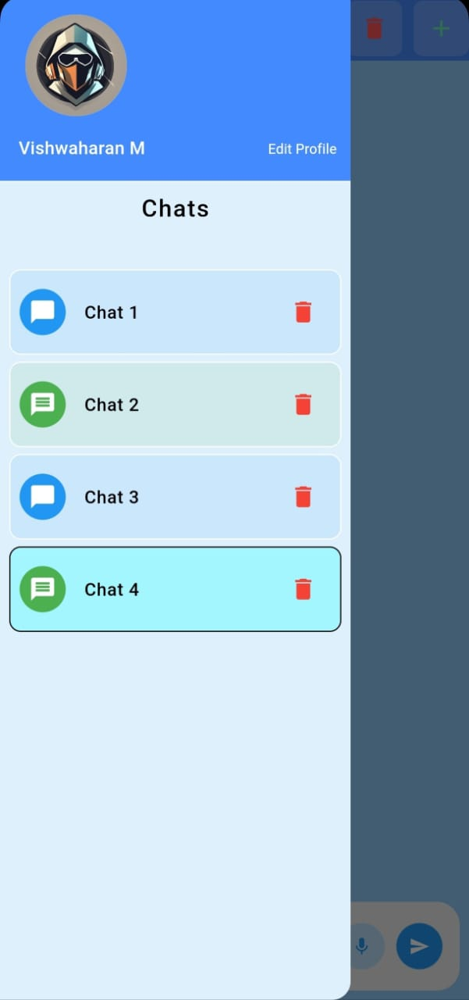
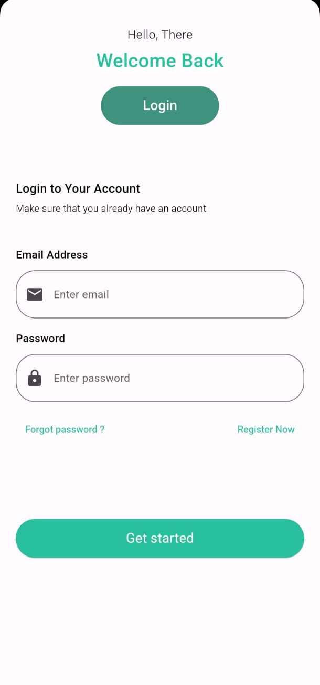
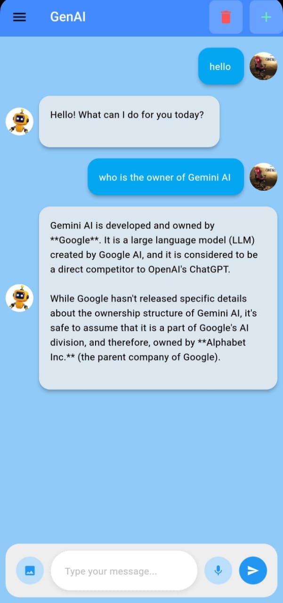
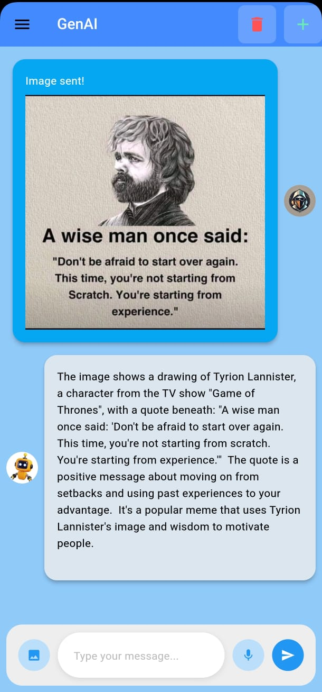

# GenAi Application

GenAi is a generative AI application powered by the Gemini AI API. It allows users to generate content using prompts, voice recognition, and image recognition, featuring multi-chat functionality for enhanced user interaction.

## Features

- **Content Generation**: Generate text-based content based on user prompts.
- **Voice Recognition**: Utilize voice commands to create and manage content effortlessly.
- **Image Recognition**: Analyze and generate content based on images.
- **Multi-Chat Functionality**: Engage in multiple conversations simultaneously, enhancing user experience.
- **User-Friendly Interface**: Intuitive design for seamless navigation and interaction.

## Technologies Used

- **Gemini AI API**: For content generation and recognition capabilities.
- **Flutter**: For building a cross-platform mobile application.

## Screenshots

     

## Acknowledgments
- Special thanks to the Gemini AI team for their innovative API.
- Inspired by the potential of AI to enhance content creation.
